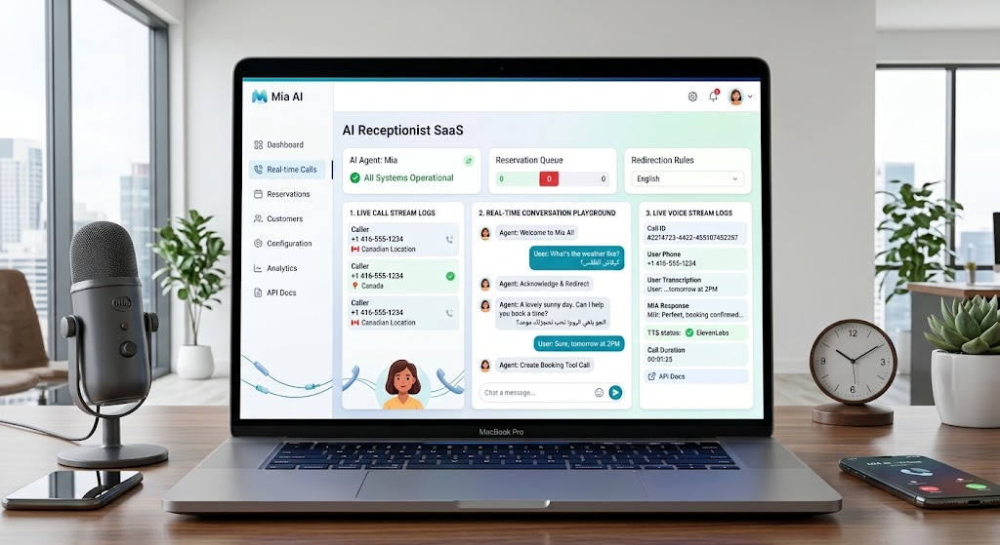

# Mia AI — Virtual AI Receptionist & Appointment Scheduling SaaS

Mia is an autonomous AI Receptionist designed to handle customer inquiries, manage scheduling, and book real-time appointments. It features a modern **React 19 Dashboard**, **in-app Live Voice Handset simulation**, and a high-performance **FastAPI backend** with optional Twilio telephony integration.



---

## Key Features

- **Autonomous Appointment Scheduling**: Checks slot availability, confirms bookings, and prevents double-booking.
- **100% Free Quickstart**: Works out-of-the-box using **Google Gemini 1.5/2.0 Flash Lite** (free API key, no credit card required) and an automatic in-memory development database.
- **Modern SaaS Dashboard**: Real-time conversation playground, call stream logs, reservation queue metrics, and system status indicators.
- **Simulated Voice Handset**: Test voice conversations directly in your browser or on your smartphone over local Wi-Fi without needing a paid Twilio number.
- **Production Telephony Ready**: Full Twilio Voice WebSockets, Deepgram Speech-to-Text, and ElevenLabs Text-to-Speech integration.

---

## Tech Stack

- **Frontend**: React 19, Vite, Tailwind CSS, Lucide Icons, Web Speech API.
- **Backend**: FastAPI, Python 3.11+, Pydantic v2, Uvicorn.
- **AI Brain**: Google Gemini (`gemini-3.5-flash-lite` or `gemini-2.0-flash`) or OpenAI (`gpt-4o-mini`).
- **Database**: In-memory store (development) or Supabase PostgreSQL with row-level security (production).
- **Voice/Telephony**: Twilio Media Streams, Deepgram Nova-3, ElevenLabs Turbo v2.5.

---

## Quick Start (For You & Friends)

### Prerequisites
Make sure you have installed:
- **Python 3.11+** ([Download](https://www.python.org/downloads/))
- **Node.js 18+ & npm** ([Download](https://nodejs.org/))
- **Git** ([Download](https://git-scm.com/))

---

### Step 1: Clone the Repository
```bash
git clone https://github.com/GhassenAllouch11236598989898/AI_Receptionist.git
cd AI_Receptionist
```

---

### Step 2: Set Up the Backend

1. **Create and activate a Python virtual environment:**
   - **Windows (PowerShell):**
     ```powershell
     python -m venv .venv
     .\.venv\Scripts\Activate.ps1
     ```
   - **Mac / Linux:**
     ```bash
     python3 -m venv .venv
     source .venv/bin/activate
     ```

2. **Install Python dependencies:**
   ```bash
   pip install -r requirements-dev.txt
   ```

3. **Configure environment variables:**
   Copy the example environment file:
   ```bash
   cp .env.example .env
   # On Windows: copy .env.example .env
   ```

   Open `.env` and configure your AI key:
   - **Option A (100% Free — Recommended):**
     Get a free key from [Google AI Studio](https://aistudio.google.com/) and paste it:
     ```env
     LLM_PROVIDER=gemini
     GEMINI_API_KEY=your_free_gemini_key_here
     GEMINI_MODEL=gemini-3.5-flash-lite
     ```
   - **Option B (OpenAI):**
     ```env
     LLM_PROVIDER=openai
     OPENAI_API_KEY=sk-...
     ```

   *(Note: You can leave `SUPABASE_URL` empty to automatically use the built-in development database).*

4. **Start the backend server:**
   ```bash
   uvicorn main:app --reload --port 8000
   ```
   Backend will be running at [http://localhost:8000](http://localhost:8000). Interactive Swagger API documentation is available at [http://localhost:8000/docs](http://localhost:8000/docs).

---

### Step 3: Set Up the Frontend Dashboard

Open a **new terminal window** in the project root:

1. **Navigate to the frontend folder:**
   ```bash
   cd frontend
   ```

2. **Install frontend dependencies:**
   ```bash
   npm install
   ```

3. **Start the Vite development server:**
   ```bash
   npm run dev
   ```

4. **Open in your browser:**
   Go to **[http://localhost:5173](http://localhost:5173)** (or port 5174 if 5173 is in use).

---

## How to Test Live Voice Calls

### Option A: In-Browser Simulated Handset (Free)
1. On the dashboard, click **"Simulate Voice Handset"** (or click the handset icon).
2. Allow microphone access when prompted.
3. Speak into your microphone (e.g. *"I'd like to book an appointment for tomorrow at 2 PM"*).
4. Mia will respond aloud through your speakers and guide you through confirming your booking.

### Option B: Test on Your Smartphone over Local Wi-Fi
1. Ensure your phone is connected to the **same Wi-Fi network** as your computer.
2. Check your computer's local IP address (e.g., `192.168.1.XX`).
3. Open your mobile browser (Safari or Chrome) and navigate to `http://<YOUR_LOCAL_IP>:5173`.
4. Tap **"Simulate Voice Handset"** and hold the phone up to your ear!

---

## Optional: Production Integrations

To connect real telephone numbers, ultra-realistic voice models, and a persistent database:

| Service | Setting in `.env` | Purpose |
| :--- | :--- | :--- |
| **Supabase** | `SUPABASE_URL`, `SUPABASE_SERVICE_ROLE_KEY` | Run `schema.sql` in Supabase SQL Editor for persistent database storage. |
| **ElevenLabs** | `ELEVENLABS_API_KEY`, `ELEVENLABS_VOICE_ID` | Ultra-realistic, human-like voice synthesis. |
| **Deepgram** | `DEEPGRAM_API_KEY` | Low-latency streaming speech-to-text. |
| **Twilio** | `TWILIO_ACCOUNT_SID`, `TWILIO_AUTH_TOKEN`, `PUBLIC_BASE_URL` | Receive incoming phone calls from cellular networks. |

---

## Running Tests

To verify that all booking logic, slot validators, and backend routes are working correctly:

```bash
pytest -q
```
All 40+ unit and integration tests run offline without consuming external API credits.

---

## Project Structure

```
AI_Receptionist/
├── main.py                     # FastAPI application entry point
├── database.py                 # In-memory & Supabase database adapter
├── models.py                   # Pydantic schemas (E.164 phone, slots, chat)
├── routers/
│   ├── chat.py                 # /chat and /bookings REST endpoints
│   └── voice.py                # Twilio incoming calls and WebSocket media streams
├── services/
│   ├── brain.py                # Gemini/OpenAI function-calling booking loop
│   ├── booking.py              # Slot conflict detection and persistence
│   ├── stt.py                  # Deepgram streaming client
│   └── tts.py                  # ElevenLabs audio generator
├── schema.sql                  # PostgreSQL database migrations for Supabase
├── frontend/
│   ├── src/
│   │   ├── components/
│   │   │   ├── RealtimeCallsView.jsx  # Main 3-column SaaS dashboard
│   │   │   ├── LiveVoiceCallModal.jsx # Simulated telephone handset
│   │   │   ├── Header.jsx             # Top bar with status and notifications
│   │   │   └── Sidebar.jsx            # Navigation links
│   │   └── api.js              # Centralized API service with proxy routing
│   └── vite.config.js          # Vite configuration with 0.0.0.0 network host
└── README.md                   # Setup guide and documentation
```

---

## License
MIT License. Created by Ghassen Allouch.
